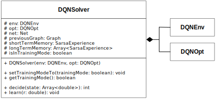
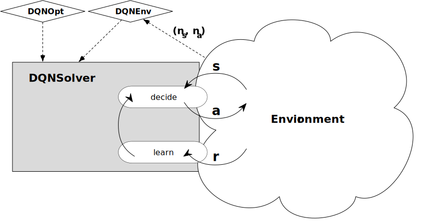

# DQNSolver

The `DQNSolver` allows to take actions in an environment and adapt it's decision making over time through environmental feedback.

## Class Structure

The following UML-Class diagram shows the composition of the Solver:

</img>

The construction of a solver requires instances of the Classes `DQNEnv` and `DQNOpt`. These instances provide all necessary information about the environment and the decision-making and learning of the Agent.

- **DQNEnv** holds information about the environment.
  - `numberOfStates` describes the length of the Vector (**s**) of observations
  - `numberOfActions` describes the number of potential actions to choose from
- **DQNOpt** holds all the hyperparamters for the *learning* and *decision making*.
  - `numberOfHiddenUnits`: depth of the neural network
  - `trainingMode`: mode of training, defines the explorative behaviour of the solver (decaying or stable)
  - `epsilon`: static exploration rate (during non-training mode)
  - `epsilonMax`, `epsilonMin`, `epsilonDecayPeriod`: linear decay of exploration during training mode
  - `alpha`: discount factor for the network update
  - `gamma`: discount factor for the bellmann function
  - `doLossClipping`: controll flag for the clipping of the loss function during learning
  - `lossClamp`: the size of the loss clipping
  - `doRewardClipping`: controll flag for the clipping of the injected reward
  - `rewardClamp`: the size of the reward clipping
  - `experienceSize`: size of the replay memory
  - `replayInterval`: interval of memory replay
  - `replaySteps`: size of the replay sample

## State-Action-Reward Scheme

The solver provides primarily two methods. The `decide`-method allows for the decision making and the `learn`-method enables the adaptive learning of the solver. To decide upon an action the solver needs a vector (`s: Array<number>`) of current observations (states) an returns the **index** of the action (`a: number`) to be executed. After the action was executed the solver takes an integer reward (`r: number`) to `learn` from the effectivity of the action.

The appended scheme gives a brief overview of the concept of the solver. As seen, the `DQNSolver` is constructed with a set of hyperparameters defined via `DQNOpt` and the description of the environment defined by `DQNEnv`. The solver is then enabled to make decisions based on a set of observations (**s**). The decision making can then be influenced by providing a reward value.

Assuming the solver has decided and learned at least once, the **s**tate and **a**ction of the current iteration plus the **r**eward, **s**tate and **a**ction of the last iteration resolve into an experience (called sarsa-tuple) for the replay memory. When aiming for a stable learning, the clipping of the *reward* and *loss* is recommended.

</img>

For further information please consult the research paper of [Mnih et al. (2015) *"Human-level control through deep reinforcement learning"*](http://www.nature.com/articles/nature14236)
